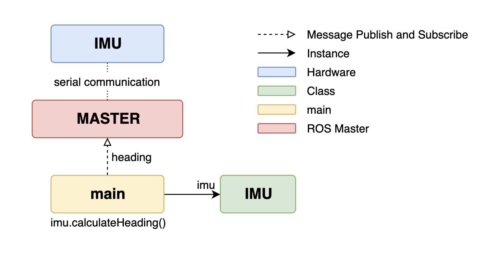
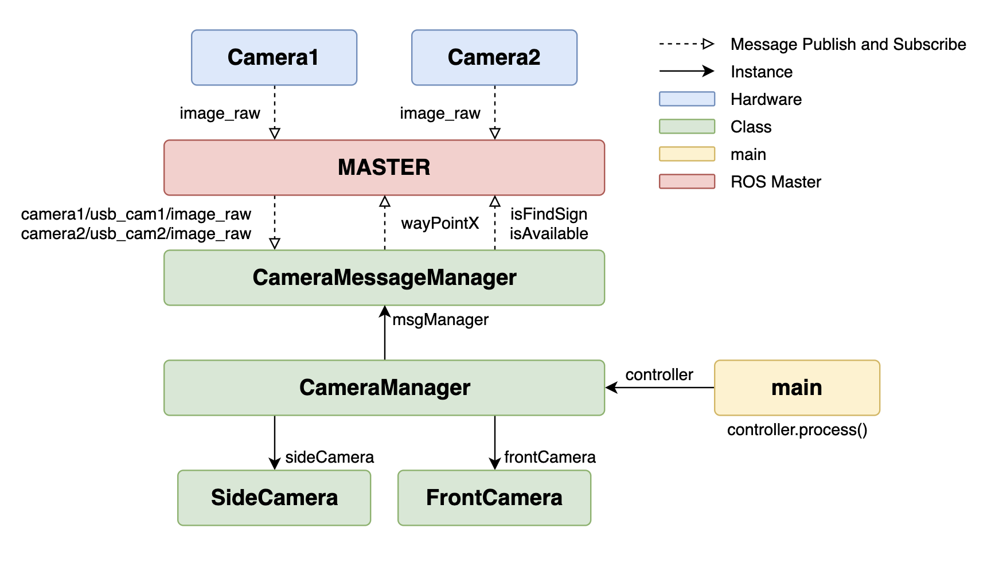
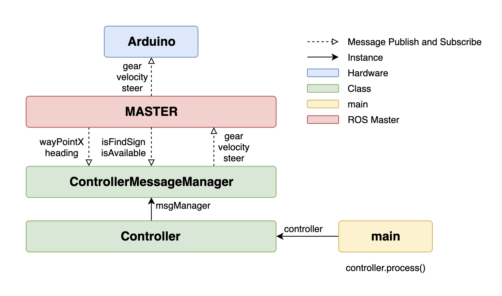
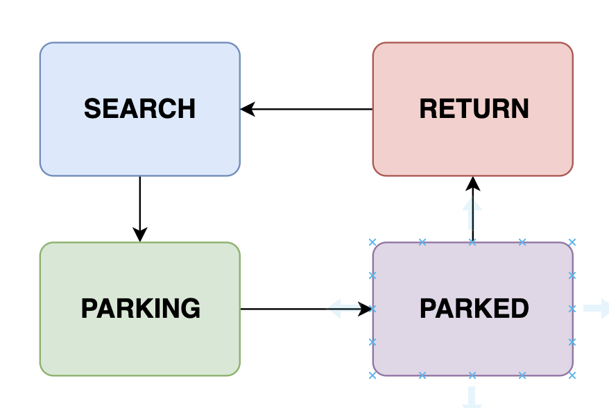

#  Graduation Project Refactoring

- Ubuntu 환경에서 ROS(Robot Operating System)을 활용한 카메라 기반 자율주차 시스템 구현
- IMU, Control, Camera를 위한 각각의 main project가 ROS의 message communication system에 의해 상호 동작.

# Class Design

- OOP(Object Oriented Programming)을 고려하여 클래스 설계를 수정함

## IMU

- IMU와 serial 통신을 통해 heading을 추출하여 Master에 publish



## Camera

- CameraMessageManager : 정면 및 측면에 장착된 두 대의 Camera로부터 publish된 raw image를 subscribe하고, raw image를 이용해 계산된 wayPoint와 주차 가능 sign을 Master에 publish
- CameraManager : CameraMessageManager로부터 받은 raw image를 이용해 정면 카메라(FrontCamera) 및 측면 카메라(Side Camera) 클래스를 생성하고 image processing으로 계산한 결과를 message manager를 통해 publish
- SideCamera : 측면 카메라 이미지를 image processing하여 주차 표지판 및 주차 가능 구역을 검출하여 주차 가능 여부를 계산
- FrontCamera : 정면 카메라 이미지를 image processing하여 wayPoint를 게산



## Controller

- ControllerMessageManager : 자동차 자율 주행을 위한 IMU의 heading과 camera image processing을 통한 wayPoint 및 주차가능 여부 sign을 Master로부터 subscribe하여 Controller에 전달
- Controller : IMU와 Camera로부터 subscribe한 데이터를 이용해서 자율 주차 시나리오에 맞는 동작을 구현



### State

- 자율 주차 시나리오에 따라 State Pattern을 적용하여 각각의 단계를 관리

  ```c++
  class Controller {
    ...
    enum ParkingState {
      SEARCH, PARKING, PARKED, RETURN
    }
    ...
  }
  ```

  - SEARCH : 주차구역을 탐색하며 전진하는 상태
  - PARKING : 주차 가능 구역을 발견하여 주차를 진행하는 상태
  - PARKED : 주차를 완료하여 잠시 정차해 있는 상태
  - RETURN : 후진으로 주차구역을 빠져나오는 상태, 다시 도로에 진입하면 SEARCH 상태로 회귀



