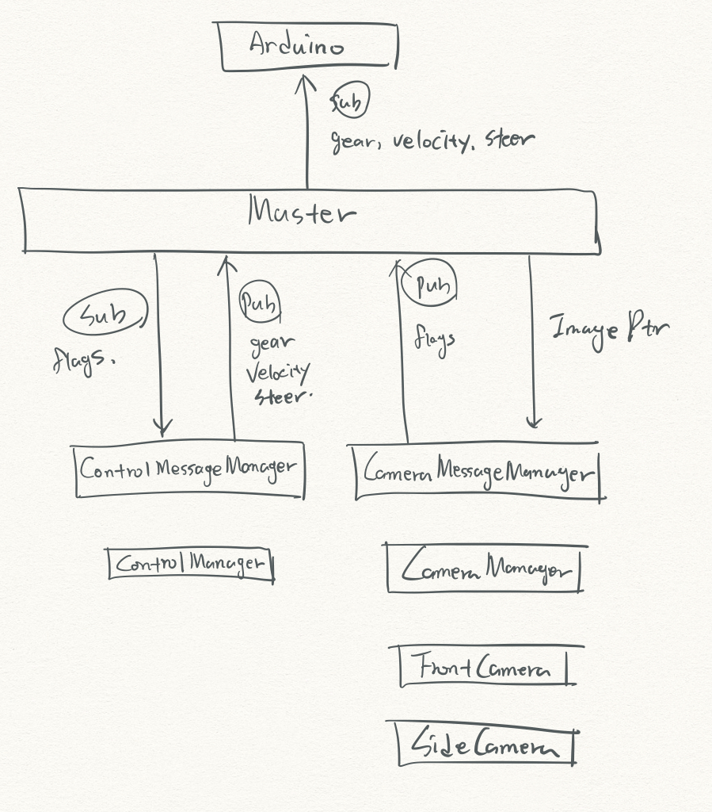
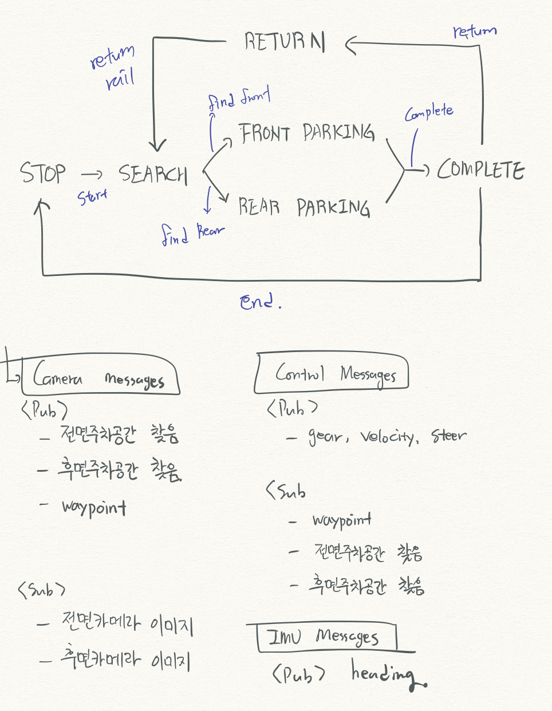

#  Auto Parking 졸업작품 Refactoring

- Ubuntu에서 ROS(Robot Operating System)을 이용하여 카메라 기반 자율주차 시스템을 구현함
- IMU, Control, Camera를 위한 각각의 main이 존재. 각각 독립된 프로젝트로서 실행될 수 있게 되어있음
- 자동차의 조향, 주행 등 control은 아두이노를 활용. 아두이노에 gear, velocity, steer를 메시지 형태로 보내서 동작함

# Sketch
## Class
- Control, Camera, IMU의 각 main에서 ros operation : init, ok loop, pub/sub message 등 ros를 class에서 빼야함
- 각 class는 각자의 역할에 맞는 data로만 구성되도록

## State

